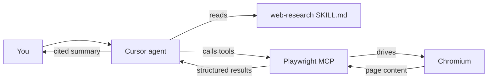

# cursor-web-research

Give the Cursor agent the ability to **open browser tabs, click around, and research the web on its own**.

**Publish to GitHub:** if you are the maintainer pushing this repository for the first time, see [PUBLISH.md](PUBLISH.md) (or run `./scripts/first-push.sh` after `gh auth login`).

It glues together two things:

1. [Microsoft's official Playwright MCP server](https://github.com/microsoft/playwright-mcp) — a real Chromium browser the agent can drive (navigate, click, type, snapshot pages, manage tabs).
2. A global Cursor **skill** that teaches the agent *when* and *how* to use those tools so "research X" becomes a one-shot behavior with a proper research loop, tab budget, safety rails, and a cited summary at the end.

Installed once per Mac, available in every Cursor project.

## Quickstart

Requires macOS or Linux, [Node.js](https://nodejs.org) >= 18, and `jq` (`brew install jq` on macOS).

### One-line install (from GitHub)

One-line install (this published repo — fork or replace the owner if you use a fork):

```bash
curl -fsSL https://raw.githubusercontent.com/zwilliams3/cursor-web-research/main/install.sh | bash
```

To pin a version, use a tag or commit SHA in place of `main` in the URL.

### Or clone, then run the script

```bash
git clone https://github.com/zwilliams3/cursor-web-research.git
cd cursor-web-research
./install.sh
```

### Optional: add the MCP server only (manual)

If you already manage `~/.cursor/mcp.json` by hand, copy the block from [`mcp.json.example`](mcp.json.example) into `mcpServers` (merge with your existing servers). In Cursor: **Settings → Features → Model Context Protocol → Edit in settings** (or the MCP panel, depending on your Cursor version) and ensure `playwright` is listed.

You can also follow Microsoft’s flow to add Playwright MCP from the docs (including Cursor-specific install): [Playwright MCP — getting started](https://playwright.dev/docs/getting-started-mcp).

### Optional: automated checks (terminal)

From a clone of this repo (after `./install.sh` or with your real `HOME`):

```bash
./scripts/verify-install.sh   # checks Node, jq, ~/.cursor/mcp.json, skill, npx @playwright/mcp --help
./scripts/smoke-browser.sh    # proves Playwright can launch Chromium and load example.com
```

`verify-install.sh` does not replace the in-app check: in **Settings → MCP**, the `playwright` server should still be green with ~20 tools.

Then:

1. Quit and reopen Cursor (or reload the MCP config from **Settings -> MCP**).
2. In **Settings -> MCP**, confirm `playwright` shows a green status and about 20 tools.
3. In any chat, say:

   > research the latest Playwright MCP release

   Cursor should open Chromium, read a couple of pages, close them, and reply with a cited markdown summary.

## What gets installed

| Path | What it is |
| --- | --- |
| `~/.cursor/mcp.json` | Registers the `playwright` server. Existing entries are preserved (the installer merges via `jq` and keeps a `.bak.<timestamp>` backup). |
| `~/.cursor/skills/web-research/SKILL.md` | Global skill the Cursor agent picks up automatically when you ask it to research something. |
| `~/Library/Caches/ms-playwright/...` | Chromium build Playwright drives (downloaded once, ~260 MB). |

No project files are touched.

## Demo (screenshot or GIF)

Add a short screen recording or screenshot here: Cursor chat asking *“research the latest Playwright MCP feature”* with Chromium window visible, then a cited summary in the thread. (Placeholder for the maintainer; optional for contributors.)

## After install: verify (checklist)

1. **MCP (in Cursor)** — **Settings → MCP** → `playwright` is green, ~20 tools (e.g. `browser_navigate`, `browser_snapshot`, `browser_tab_new`). Run `./scripts/verify-install.sh` in a terminal to sanity-check config files and the MCP CLI.
2. **Browser stack (optional)** — `./scripts/smoke-browser.sh` confirms Playwright can drive Chromium for a public URL outside the agent.
3. **End-to-end (in Cursor chat)** — *“Research the latest @playwright/mcp release notes and cite your sources.”* You should see the browser work and a markdown summary with URLs.

## How the agent uses it



Under the hood the skill enforces:

- **Activation triggers** — "research", "look up", "find docs for", "compare", "what's the latest on", etc.
- **Standard loop** — search -> snapshot results -> open top 1-3 links in new tabs -> read -> close tabs -> summarize.
- **Budgets** — max 5 tabs, 15 navigations, roughly 2 minutes wall-clock, one refinement pass.
- **Safety rails** — never sign in, never submit non-search forms, never download files, stop on paywalls or CAPTCHAs, no more than ~10 navigations to any single origin.
- **Output** — every non-trivial claim carries an inline source link.

Read the full rulebook in [`skills/web-research/SKILL.md`](skills/web-research/SKILL.md).

## Headless vs. headed

Playwright MCP runs a **visible (headed) browser by default** — no extra flags. For headless mode, add a single **boolean** flag: `"--headless"` to the `args` array in `~/.cursor/mcp.json` (the CLI does not support `--headless=false` or similar; that form causes `unknown option`).

## Troubleshooting

- **`playwright` shows red in Settings -> MCP.** Make sure `node -v` prints >= 18 in a new terminal. If Cursor was started from the macOS dock it may not see nvm-installed Node; reinstalling Node from nodejs.org (or using Homebrew's `node`) usually fixes it.
- **Agent won't open the browser.** Confirm the skill file lives at `~/.cursor/skills/web-research/SKILL.md`. Ask the agent to "list your skills".
- **Cursor says you've hit the MCP tool cap.** Cursor allows ~40 active tools across all MCP servers and Playwright adds ~20. Disable a server you're not using.
- **Every tool call prompts for approval.** Expected for a new MCP server. Once you're comfortable, enable auto-run for `playwright` in **Settings -> MCP**.

## Uninstall

```bash
./uninstall.sh
```

Removes the `playwright` entry from `~/.cursor/mcp.json` and deletes the skill. Leaves the Chromium cache in place (other tools may use it).

## License

[MIT](LICENSE).

## Credits

- [microsoft/playwright-mcp](https://github.com/microsoft/playwright-mcp) — does all the heavy lifting. This repo is just a one-command wrapper plus the agent-steering skill.

## Contributing

See [CONTRIBUTING.md](CONTRIBUTING.md).
